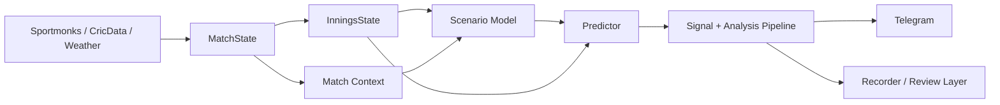

# Glitch Cricket Engine


Live cricket intelligence for IPL and PSL matches. Glitch Cricket Engine ingests live match state, enriches it with player, venue, and innings context, runs multiple projection layers on top of that state, and turns the result into structured analysis and Telegram-ready outputs.

This repository is published as an open-source working system, while preserving the original Glitch project identity and authorship.

## Why This Repo Exists

A lot of cricket bots stop at scoreboard extrapolation: current run rate, wickets, venue average, projected total. That gets you a number, but not a trustworthy read on match script.

Glitch Cricket Engine exists to go one layer deeper:
- normalize live match state into a stable internal model
- reason about batting and bowling resources still available
- project sessions and innings through context-aware logic
- classify chase pressure, contradictions, and regime changes
- preserve a review trail through recording and simulation infrastructure

The goal is not just to estimate a total, but to explain why the game is bending in a particular direction.

## System Overview



## Main Components

- `spotter.py`
  The main live scan loop and decision pipeline.
- `liveline_bot.py`
  The live line listener and side-channel event consumer.
- `modules/`
  Prediction, state, context, provider clients, analysis helpers, and legacy execution/paper infrastructure.
- `series/`
  Competition-specific profiles and registry logic.
- `scripts/`
  Data-building, reporting, and diagnostics helpers.
- `tests/`
  Unit and integration-oriented tests.
- `systemd/`
  Service definitions used in the server deployment.

See also:
- [Architecture](docs/ARCHITECTURE.md)
- [Roadmap](docs/ROADMAP.md)
- [Platform Map](docs/PLATFORM_MAP.md)
- [Strategy Matrix](docs/STRATEGY_MATRIX.md)
- [Setup and Security](docs/SETUP_AND_SECURITY.md)

## Repository Structure

```text
modules/      prediction, context, providers, state, recorder, utilities
series/       competition profiles and registry
scripts/      model/data utilities and reporting helpers
tests/        automated checks
docs/         public project docs
systemd/      deployment service files
```

Local module guides:
- [modules/README.md](modules/README.md)
- [scripts/README.md](scripts/README.md)
- [series/README.md](series/README.md)

## Quick Start

### 1. Clone

```bash
git clone git@github.com:glitch-executor/glitch-cricket-engine.git
cd glitch-cricket-engine
```

### 2. Create a virtual environment

```bash
python3 -m venv venv
source venv/bin/activate
pip install -U pip
pip install -r requirements.txt
```

### 3. Configure runtime settings

```bash
cp ipl_spotter_config.example.json ipl_spotter_config.json
```

Fill in your own provider keys and environment-specific values in `ipl_spotter_config.json`.

### 4. Run the main engine

```bash
python spotter.py
```

### 5. Run the live line listener

```bash
python liveline_bot.py
```

## Usage Orientation

This repository still contains execution-era components such as Cloudbet, paper simulation, and shadow tracking because they provide review and validation value. For public use, the cleanest way to think about the repo is:

1. live state ingestion
2. state enrichment
3. projection and scenario analysis
4. context gating
5. output / recording

You can use it as:
- a live analysis engine
- a signal-generation base
- a cricket modeling research platform
- a reviewable paper-analysis workflow

## Branding and Attribution

Glitch Cricket Engine is the original project identity for this repository.

For forks and downstream distributions:
- keep `LICENSE`
- keep `NOTICE`
- preserve original attribution in a reasonable visible place

Apache 2.0 allows broad reuse, but it does not grant trademark rights beyond what the license expressly allows.

## Licensing

This project is released under the Apache License 2.0.

See:
- [LICENSE](LICENSE)
- [NOTICE](NOTICE)
- [AUTHORS.md](AUTHORS.md)

## Public Release Safety

This public repository intentionally excludes:
- live credentials and local config
- runtime logs and pid files
- state databases and session files
- virtual environments
- local training or model artifacts under ignored runtime paths

The shared config template is:
- [ipl_spotter_config.example.json](ipl_spotter_config.example.json)

## Status

Strong already:
- live state ingestion
- session and innings analysis flow
- resource-aware state modeling
- scenario and chase-layer integration
- review-oriented recorder infrastructure

Still evolving:
- ML feature alignment and reproducibility
- deeper batter-vs-bowler and bowler resource logic
- cleaner fresh-install setup
- broader public documentation and CI maturity
