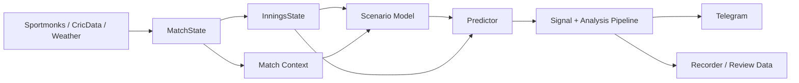

# Glitch Cricket Engine


A live cricket intelligence engine for IPL and PSL matches. It ingests live match state, enriches it with player, venue, and innings context, runs projection layers on top of that state, and turns the result into structured match analysis and Telegram-ready signals.

This codebase started life as a live-betting system and still contains execution, shadow-tracking, and paper-simulation infrastructure. The current direction is sharper than that: evolve the bot into a stronger cricket analysis engine with better state modeling, cleaner feedback loops, and more trustworthy projections.

## Why This Exists

Cricket bots often stop at score extrapolation: current run rate, wickets, venue average, projected total. That gets you a number, but it misses match script. This engine pushes deeper by combining:

- live score and ball state
- batting resources left
- bowling resources left
- chase pressure state
- scenario branching on wicket risk
- consistency rules across innings/session signals
- recorded outcomes for later review

The goal is not just to say *what the projected number is*, but also *why the game is tilting that way*.

## Core Capabilities

- Live match ingestion and normalization via `MatchState`
- Session projections for `6_over`, `10_over`, `15_over`, `20_over`, and `innings_total`
- Match-winner estimation for chase and first-innings scenarios
- Resource-aware innings modeling via `InningsState`
- Scenario-tree forecasting with wicket branching
- Chase-state classification with pressure bands
- Match-context veto and contradiction checks
- Telegram-ready formatting for signals and analysis
- Match recording, signal history, and paper-trading traces for review
- Competition-aware fixture support for IPL and PSL

## Architecture



More detail: [docs/ARCHITECTURE.md](docs/ARCHITECTURE.md)

## Example Output

```text
🏏 15 Over
━━━━━━━━━━━━━━━━━━━━━━━━━━━━━━
🔴 NO  126 runs
💵 Stake: 20% of match capital
━━━━━━━━━━━━━━━━━━━━━━━━━━━━━━
🔺 Islamabad United  🆚  🟣 Quetta Gladiators
  Score: 77/2 (9.1 ov) RR:8.4 | Need 107 off 10.9 ov (target 184)
```

What sits behind a message like that:
- live innings state
- over-phase weighting
- batting depth left
- wicket hazard assumptions
- chase regime / pressure band
- context checks to avoid contradictory calls

## Repository Guide

- `spotter.py`: main live scan loop and signal pipeline
- `liveline_bot.py`: live line listener and side-channel updates
- `modules/`: prediction, state, context, and integrations
- `series/`: competition-specific profiles and registry
- `scripts/`: model building, diagnostics, and reporting helpers
- `tests/`: unit and integration-oriented tests
- `systemd/`: server service definitions
- `ipl_spotter_config.example.json`: sanitized runtime config template
- `docs/`: setup, security, and architecture notes

## Quick Start

### 1. Clone

```bash
git clone git@github.com:glitch-executor/glitch-cricket-engine.git
cd glitch-cricket-engine
```

### 2. Create a virtual environment

```bash
python3 -m venv venv
source venv/bin/activate
pip install -U pip
pip install -r requirements.txt
```

### 3. Configure runtime settings

```bash
cp ipl_spotter_config.example.json ipl_spotter_config.json
```

Fill in your own provider keys and environment-specific values in `ipl_spotter_config.json`.

### 4. Start the main engine

```bash
python spotter.py
```

### 5. Start the line listener

```bash
python liveline_bot.py
```

## Analysis Stack

The current engine is layered rather than single-formula:

1. `MatchState`
- normalizes live scoreboard and player state

2. `InningsState`
- estimates batting depth, remaining quality, and bowling resources

3. Scenario + chase layers
- scenario tree branches on wicket risk
- chase state machine classifies the innings into pressure bands

4. Predictor
- blends historical baselines with live resources and scenario output

5. Context rules
- suppress contradictory or low-quality signals

## Status Today

What is already strong:
- live state ingestion
- signal pipeline wiring
- analysis/reporting flow
- resource-aware innings logic
- scenario/chase modeling integration

What is still evolving:
- ML feature alignment and reproducibility
- deeper batter-vs-bowler matchup modeling
- cleaner dependency setup for fresh installs
- broader public-facing documentation and tests

## Security and Setup

This repository is intentionally published without live secrets, runtime logs, databases, or local virtual environments.

See:
- [docs/SETUP_AND_SECURITY.md](docs/SETUP_AND_SECURITY.md)
- [ipl_spotter_config.example.json](ipl_spotter_config.example.json)

## Roadmap

- Stronger over-by-over scenario modeling
- Better wicket hazard calibration
- Cleaner chase-script reasoning in innings 2
- Improved public install reproducibility
- Richer review tooling for signal quality and model drift

## License / Usage

This repo is currently published as a working project codebase, not a packaged open-source library. Review and adapt it carefully before using it in a production environment.
